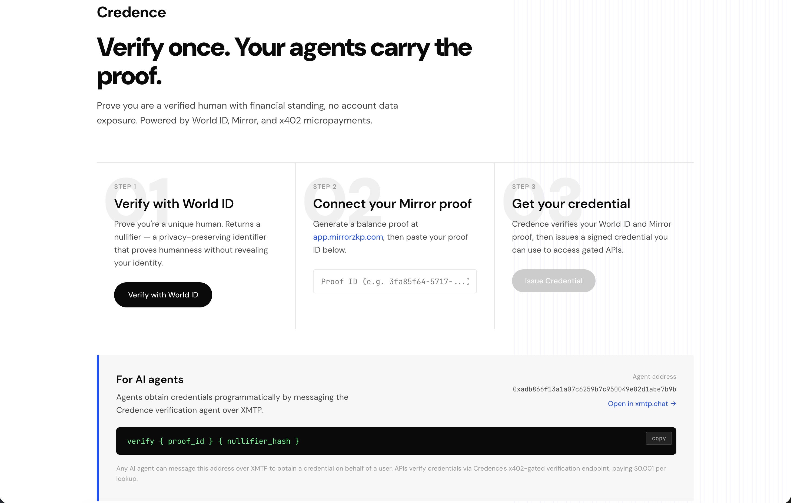

# Credence

**Verify once. Your agents carry the proof.**

Credence is a verification gateway for the agentic internet. It lets users prove they are a real human with financial standing — then any AI agent acting on their behalf can carry that credential to access gated APIs, with no account data exposed.



Powered by **World ID**, **Mirror**, and **x402 micropayments**.

---

## How It Works

### For Users

1. **Verify with World ID** — Prove you're a unique human. Returns a nullifier (privacy-preserving, no identity revealed).
2. **Connect a Mirror proof** — Generate a ZK balance proof at [app.mirrorzkp.com](https://app.mirrorzkp.com). Proves financial standing without revealing your actual balance.
3. **Get your credential** — Credence verifies both inputs and issues a signed credential.

### For AI Agents

Agents obtain and use credentials programmatically:

- **Issuance**: An agent messages the Credence XMTP agent with `verify {proof_id} {nullifier}` and receives a credential.
- **Verification**: When an agent presents a credential to a gated API, the API calls Credence's x402-gated verification endpoint ($0.001 USDC per lookup) to confirm it's valid.
- **Agent-to-agent**: Three agents communicate over XMTP — the user's agent (A) requests access from an API agent (B), which verifies the credential with the Credence agent (C), then grants access.

### For API Providers

Gate any endpoint in one line with the `credence-gate` SDK:

```typescript
// HTTP APIs (Express middleware)
import { credenceGate } from 'credence-gate';

app.get('/api/premium-data', credenceGate(), (req, res) => {
  // req.credence contains the verified credential
  // Only verified humans with financial standing reach here
  res.json({ data: '...' });
});
```

```typescript
// XMTP Agents
import { verifyCredentialOverXMTP } from 'credence-gate/xmtp';

const result = await verifyCredentialOverXMTP(agent, credentialId);
if (result.valid) {
  // Grant access
}
```

---

## Required Technologies

### World ID

World ID provides proof of unique humanness via zero-knowledge proofs. Users verify through the IDKit widget in the Credence frontend. The verification returns a `nullifier_hash` — a privacy-preserving identifier unique to the user + app combination, with no link to the user's real identity.

- **Integration**: `@worldcoin/idkit` in the frontend (`frontend/app/page.tsx`)
- **Verification level**: Device (Orb not required)
- **Action**: `mirror-verify`

### x402 (Coinbase)

x402 is Coinbase's HTTP payment protocol on Base. Credence uses it to monetize credential verification — any API that wants to check if a credential is valid pays $0.001 USDC per lookup. This creates a sustainable business model: users get credentials for free, APIs pay to verify them.

- **Integration**: `@x402/express` with `paymentMiddleware`, `x402ResourceServer`, `HTTPFacilitatorClient`, and `ExactEvmScheme` on the `/v1/credentials/:id/verify` endpoint (`api/src/index.ts`)
- **Network**: Base Sepolia (testnet) / Base Mainnet (production)
- **Price**: $0.001 USDC per credential verification
- **Facilitator**: `https://www.x402.org/facilitator`

### XMTP

XMTP is the messaging layer agents use to communicate. Credence runs an XMTP agent that issues and verifies credentials. The demo shows three agents talking to each other over XMTP:

- Agent A (user's agent) requests access from Agent B (API provider)
- Agent B asks Agent C (Credence) to verify the credential
- Agent C confirms, and Agent B grants access to Agent A

**Integration**:
- `@xmtp/agent-sdk` for the Credence agent (`agent/src/index.ts`)
- `verifyCredentialOverXMTP()` in the `credence-gate` SDK (`sdk/src/xmtp.ts`) — one function call for any agent to verify a credential over XMTP
- Three-agent demo script (`demo/agent-client.ts`)

---

## Architecture

```
┌──────────────┐     ┌──────────────────┐     ┌──────────────────┐
│   Frontend   │     │  Credence Agent   │     │   Credence API   │
│  (Next.js)   │     │    (XMTP)        │     │   (Express)      │
│              │     │                  │     │                  │
│ World ID     │────>│ verify           │────>│ POST /v1/verify  │
│ Mirror proof │     │ check-credential │     │ GET /v1/creds/   │
│ Issue cred   │────>│                  │     │   :id/verify     │
└──────────────┘     └──────────────────┘     │   (x402-gated)  │
                                              └────────┬─────────┘
                                                       │
                              ┌─────────────────────────┘
                              │ Upstream APIs
                              v
                     ┌──────────────────┐
                     │   Mirror API     │  Free: /v1/proofs/:id/verify
                     │ api.mirrorzkp.com│  Free: /verify/:shareToken
                     └──────────────────┘

┌──────────────────────────────────────────────────────────────────┐
│                      credence-gate SDK                           │
│                                                                  │
│  credenceGate()                 verifyCredentialOverXMTP()       │
│  Express middleware             XMTP agent helper                │
│  for HTTP APIs                  for agent-to-agent               │
└──────────────────────────────────────────────────────────────────┘
```

---

## Project Structure

```
credence/
├── api/                     # Credence API (Express)
│   └── src/
│       ├── index.ts         # Routes: /v1/verify, /v1/credentials/:id/verify, /api/premium-data
│       ├── config.ts        # Environment config
│       └── credentials.ts   # Credential issuance + HMAC signing
│
├── agent/                   # Credence XMTP agent
│   └── src/
│       ├── index.ts         # XMTP message handlers (verify, check-credential)
│       └── verify.ts        # Calls Credence API for credential issuance
│
├── frontend/                # Next.js frontend
│   └── app/
│       ├── page.tsx         # World ID + Mirror proof + credential issuance UI
│       ├── layout.tsx       # Fonts and metadata
│       └── globals.css      # Design system
│
├── sdk/                     # credence-gate SDK
│   └── src/
│       ├── index.ts         # Express middleware: credenceGate()
│       └── xmtp.ts          # XMTP helper: verifyCredentialOverXMTP()
│
├── demo/                    # Three-agent demo script
│   └── agent-client.ts      # Agent A ↔ Agent B ↔ Agent C over XMTP
│
└── README.md
```

---

## Running Locally

### Prerequisites

- Node.js 18+
- npm

### 1. Clone and install

```bash
git clone https://github.com/SarahMAmann/agentkit-hackathon.git
cd agentkit-hackathon
```

Install dependencies for each package:

```bash
cd api && npm install && cd ..
cd agent && npm install && cd ..
cd frontend && npm install && cd ..
cd sdk && npm install && cd ..
cd demo && npm install && cd ..
```

### 2. Configure environment variables

**API** (`api/.env`):
```bash
cp api/.env.example api/.env
```
Edit `api/.env`:
```
MIRROR_API_URL=https://api.mirrorzkp.com
MIRROR_WALLET_ADDRESS=0x...          # Your Base wallet (for x402 receipts)
REQUIRE_PAYMENT=false                 # Set true to enforce x402
CREDENTIAL_SECRET=your-random-secret
PORT=3002
CORS_ORIGIN=http://localhost:3000
```

**XMTP Agent** (`agent/.env`):
```bash
cp agent/.env.example agent/.env
```
Generate XMTP keys:
```bash
node -e "const c=require('crypto'); console.log('XMTP_WALLET_KEY=0x'+c.randomBytes(32).toString('hex')); console.log('XMTP_DB_ENCRYPTION_KEY=0x'+c.randomBytes(32).toString('hex'))"
```
Edit `agent/.env`:
```
XMTP_WALLET_KEY=0x...
XMTP_DB_ENCRYPTION_KEY=0x...
XMTP_ENV=dev
MIRROR_API_URL=http://localhost:3002
```

**Frontend** (`frontend/.env`):
```bash
cp frontend/.env.example frontend/.env
```
Edit `frontend/.env`:
```
NEXT_PUBLIC_WORLD_APP_ID=app_...      # From developer.worldcoin.org
NEXT_PUBLIC_MIRROR_API_URL=http://localhost:3002
NEXT_PUBLIC_XMTP_AGENT_ADDRESS=0x... # Logged when agent starts
```

### 3. Start all services

In three separate terminals:

```bash
# Terminal 1: API
cd api && npm run dev

# Terminal 2: XMTP Agent
cd agent && npm run dev

# Terminal 3: Frontend
cd frontend && npm run dev
```

The agent will log its XMTP address on startup — add that to `frontend/.env` as `NEXT_PUBLIC_XMTP_AGENT_ADDRESS`.

### 4. Use the app

1. Open http://localhost:3000
2. Verify with World ID
3. Paste your Mirror proof ID (or share token) from [app.mirrorzkp.com](https://app.mirrorzkp.com)
4. Click "Issue Credential"

### 5. Run the agent demo

After getting a credential from the frontend:

```bash
cd demo
npx tsx agent-client.ts <your_credential_id>
```

This runs the full three-agent flow over XMTP:
- Agent A requests access from Agent B
- Agent B verifies the credential with Credence (Agent C)
- Agent C confirms, Agent B grants access

---

## Team

Built by Sarah Amann at the Coinbase x World x XMTP hackathon.
